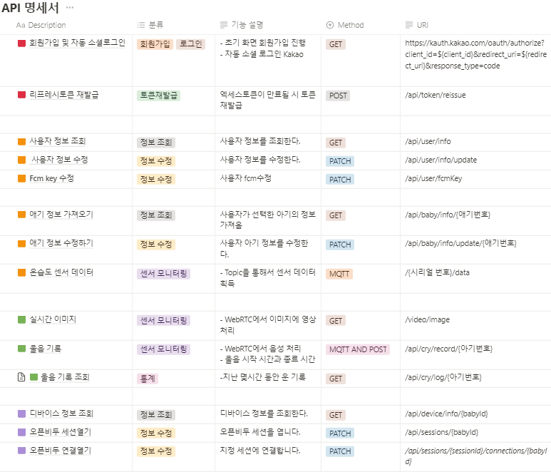

# :question: 왜 "토닥토닥"을 사용해야 하나요?

## WHY

- 육아 부담 감소
- 영유가 위기 상황 대응 및 개선

## HOW

- 아기 주변 온도, 습도 제공

- 실시간 아기 영상 스트리밍 제공

- 아기 뒤집기 및 울음소리 알림 제공
  
  > <span style="color:red"><b>아기 상태 확인 -> 효율적인 육아</b></span>

## ❗ 특장점

- 아기 뒤집기 판단이 가능한 ****영상 인식 ai**** 

- 아기 울음 판단이 가능한 ****음성 인식 ai****  

## :star2: 주요 기능

```
☝ 실시간 아기 주변 온도, 습도 확인 가
✌ 실시간 아기 영상 확인 및 뒤집기 알림
👌 울음 기록 조회 및 울음 알림
```

# 🚀 배포 주소 : [ :baby: 토닥토닥](https://todaktodak.kr) [https://todaktodak.kr](https://todaktodak.kr)

### 

### 🎫 ERD

 

### 

### 🍏 API

 

### 

### 🎇 서비스 아키텍쳐


### 

### 📜 프로젝트 결과물


### Member & Role 👪

| 이름  | 담당 영역    |
| --- | -------- |
| 김이삭 | IOT      |
| 김관섭 | FrontEnd |
| 김민준 | BackEnd  |
| 엄희원 | IOT      |
| 장준호 | FrontEnd |
