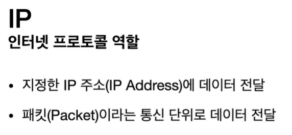

# 모든 개발자를 위한 HTTP 웹 기본 지식

그냥 보내면 안되고 IP패킷을 만들어서 보내야한다.

계속 전달전달 하게 되면 서버까지 도달하게 된다.

서버에서도 패킷을 전달.

비연결성 - 서버가 꺼져있을 경우도 있음

한 PC에서 어플리케이션을 다양하게 사용한다면

프로그램 구분을 어떻게 하지?

중간에 노드가 소실되면 통신 안됨

패킷의 용량이 굉장히 클 수 있다.

패킷은 끊어보내야함

패킷들이 중간에 다른 노드를 탈 수 있음

마지막에 패킷순서가 달라질 수 있음

이런 문제들은 TCP 프로토콜로 해결 가능하다.

### TCP/UDP

채팅프로그램으로 Hello World넘기고싶다.

TCP정보를 씌움

IP관련 데이터를 씌움

Ethernet 프레임을 마지막에 씌워서 보냄

패킷 = 수하물(패키지) + 덩어리(버킷)의 합성어

연결지향-서버가 현재 연결이 가능한지 체크가능

데이터 전달 보증 - 데이터 누락 방지

순서 보장 - 데이터 전달 순서 보장

SYN메세지

알겠어 ACK + 나도 연결해줘 SYN메세지

알겠어 ACK

연결 후 데이터 전송

요즘에는 마지막 ACK할 때 데이터도 보냄

가상연결이다 아마 됐을 거다~

수많은 노드들이 연결되어있는지는 모름

논리적으로만 연결이 된것임

중간에 잘못 보내면 잘못보낸거부터 다시보내라고 요청

전송정보가 TCP패킷 안에 들어있기 때문에 가능한것

포트가 추가

포트는 애플리케이션 구분을 하기 위한 것

데이터를 검증하는 체크섬정도만 있음

threewayhandshake가 없으니 빠름

tcp는 최적화를 할 수가 없음

tcp는 그대로 쓰고 udp를 손대면 됨

tcp 프로토콜은 요즘 90퍼센트 이상 사용

그러나 최근에는 udp각광

http 3에서 udp프로토콜을 사용해보자하는 추세

IP는 목적지

PORT는 애플리케이션 구분용

ip는 아파트

포트는 동호수

URI

⇒ 로케이터(locator),이름(name)또는 둘다 추가로 분류될 수 있다.

자원의 위치를 식별하는 방법

URL

⇒ Resource Locator(김민준이 사는 집)을 찾으면 김민준이 나옴

URN

⇒ Resource Name(김민준)

거의 URL만씀

URN은 이름에 매핑을 시켜야하는데 1:1매칭이 쉽지않음

[https://www.google.com/search?q=](https://www.google.com/search?q=)hello&hl=ko

scheme에는 프로토콜 정보,port path,query

특정서버에 따로 접속하기 위해서 사용됨

hl은 언어

쿼리는 물음표로 시작 &로 추가 가능

웹으로 변수를 넘긴다하여 query parameter

숫자를 써도 전부 문자열로 넘어가므로 query string이라고 불린다.

1. DNS조회랑 PORT정보를 조회하여 IP가 나온다.
2. 그리고 HTTP 요청 메시지 생성

구글과 SYN + SYN/ACK + ACK을 통해서 연결

애플리케이션

os

네트워크인터페이스

서버에 도착하면 감싸져있는거 다 버리고

http메세지만 봄
